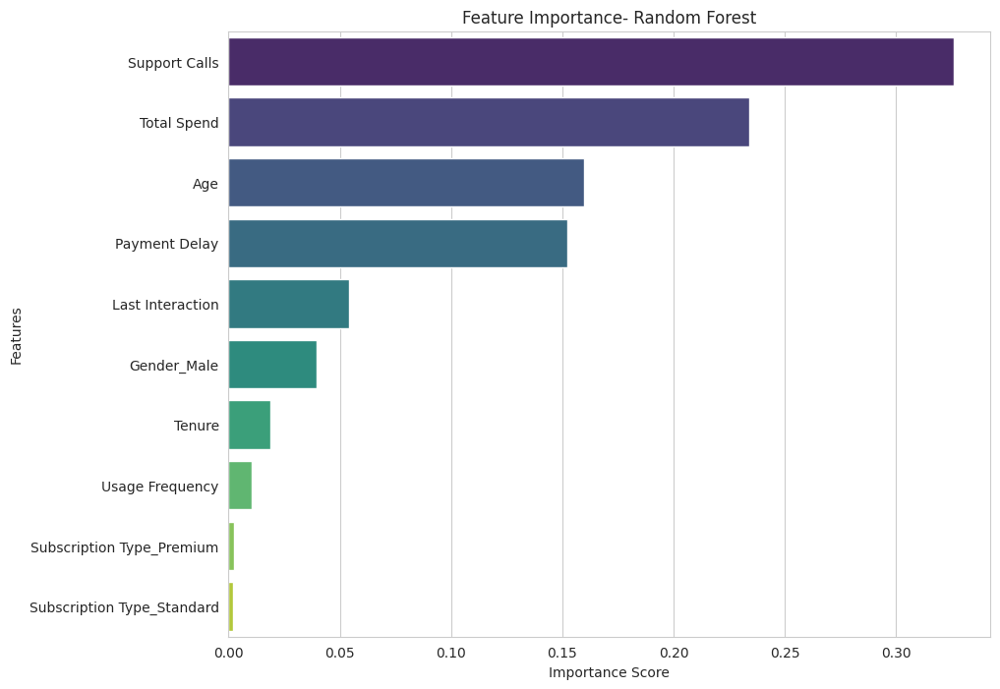

# Customer Churn Prediction for a SaaS Company

![Project Banner] This project is an end-to-end data science analysis aimed at predicting customer churn for a subscription-based SaaS company. The primary goal is to build a machine learning model that can accurately identify customers at risk of churning, enabling the business to implement targeted retention strategies. This repository contains the complete analysis, from data cleaning and exploratory data analysis to model training, evaluation, and interpretation.

---

### 📜 Table of Contents
* [Project Overview](#-project-overview)
* [Tech Stack](#-tech-stack)
* [Project Structure](#-project-structure)
* [Workflow](#-workflow)
* [Key Findings from EDA](#-key-findings-from-eda)
* [Model Performance](#-model-performance)
* [Model Interpretation](#-model-interpretation)
* [Conclusion & Business Impact](#-conclusion--business-impact)

---

### 🚀 Project Overview
In the competitive Software-as-a-Service (SaaS) industry, customer churn is a critical metric directly impacting revenue and growth. This project focuses on developing a robust machine learning model to predict customer churn. By identifying the key drivers and predicting at-risk customers, the business can proactively address issues, improve customer satisfaction, and reduce revenue loss.

---

### 💻 Tech Stack


---

### 📂 Project Structure
```
customer-churn-prediction/
├── .gitignore
├── LICENSE
├── README.md
├── customer_churn_analysis.ipynb
├── data/
│   └── customer_churn_dataset-training-master.csv
└── images/
    ├── feature_importance.png
    └── ... (other plots)
```
---

### ⚙️ Workflow
The project followed a structured data science workflow:

1.  **Data Cleaning & Preprocessing:**
    * Handled missing values (a single row with NaNs was dropped).
    * Corrected data types for relevant columns (e.g., `CustomerID`, `Churn`).
    * Performed one-hot encoding on categorical features (`Gender`, `Subscription Type`, `Contract Length`) to prepare them for modeling.

2.  **Exploratory Data Analysis (EDA):**
    * Conducted univariate and bivariate analysis to understand feature distributions and their relationships with the target variable, `Churn`.
    * Visualized data using histograms, box plots, and bar charts to identify key patterns and potential churn drivers.

3.  **Data Leakage Investigation:**
    * Initial modeling with a Random Forest classifier yielded a near-perfect accuracy (99.9%), which was a strong indicator of data leakage.
    * Through investigation, it was discovered that the `Contract Length` feature was the source of the leak, as the "Monthly" contract category had a 100% churn rate in the dataset.
    * This feature was removed to build a more robust and realistic model, demonstrating critical thinking and a thorough validation process.

4.  **Model Training & Evaluation:**
    * The dataset was split into training (80%) and testing (20%) sets using stratified sampling to maintain class proportions.
    * Trained and evaluated two models:
        * **Logistic Regression:** Served as a baseline model.
        * **Random Forest Classifier:** A more powerful ensemble model.
    * Models were evaluated using Accuracy, Precision, Recall, and F1-Score, with a focus on the F1-Score for a balanced assessment.

5.  **Model Interpretation:**
    * Extracted and visualized feature importances from the final Random Forest model to understand the key factors driving its predictions.

---

### 📊 Key Findings from EDA
* **Strong Churn Indicators:** EDA revealed that a high number of **Support Calls**, high **Payment Delays**, and low **Total Spend** were strongly associated with a customer churning.
* **Contract Length Impact:** Customers on **Monthly contracts** were found to be extremely likely to churn (100% churn rate in the data, identifying a data leakage issue), while those on Annual or Quarterly contracts had significantly lower churn rates.
* **Demographic Factors:** Female customers showed a higher churn rate (66.7%) compared to male customers (49.1%). Older customers also showed a slightly higher tendency to churn.
* **Weak Indicators:** Features like `Usage Frequency` and `Subscription Type` (Basic/Standard/Premium) showed a very weak correlation with churn.

---

### 📈 Model Performance
The Random Forest model significantly outperformed the Logistic Regression baseline, even after handling the data leakage.

| Model                 | F1-Score (Churn) | Accuracy | Precision (Churn) | Recall (Churn) |
| --------------------- | ---------------- | -------- | ----------------- | -------------- |
| Logistic Regression   | 0.90             | 89.3%    | 0.92              | 0.89           |
| **Random Forest (Final)** | **0.99** | **98.8%** | **1.00** | **0.98** |

---

### 💡 Model Interpretation
The final Random Forest model's predictions were driven by features that aligned perfectly with the EDA findings. The top 4 most important features were:
1.  **Support Calls**
2.  **Total Spend**
3.  **Age**
4.  **Payment Delay**

This confirms that customer service interactions and spending patterns are the most influential factors in predicting churn for this dataset.


---

### ✅ Conclusion & Business Impact
This project successfully developed a high-performance Random Forest model capable of predicting customer churn with **98.8% accuracy** and a **99% F1-score**.

**Business Value:**
* **Proactive Retention:** The model can be used to identify at-risk customers in real-time, allowing the business to deploy targeted retention campaigns (e.g., special offers, proactive support) before the customer leaves.
* **Actionable Insights:** The feature importance analysis provides clear, actionable insights. To reduce churn, the business should focus on improving the customer support experience and addressing issues related to high payment delays and low customer spending.
* **Resource Optimization:** By focusing retention efforts on a targeted, high-risk segment, the company can optimize its marketing and support resources for maximum impact.

The process also highlighted the importance of critical evaluation, as identifying and handling data leakage was essential for creating a truly valuable and reliable model.

---
